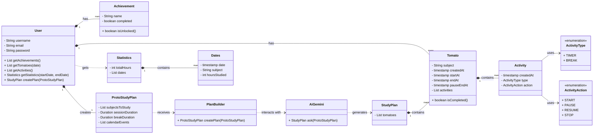
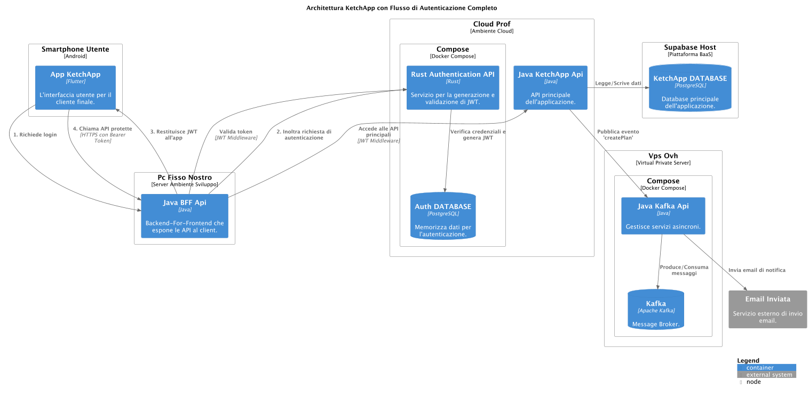
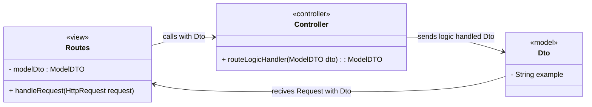
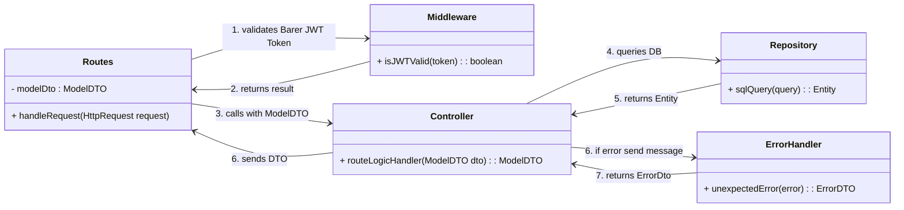

# Relazione KetchApp | Corso Progettazione e Sviluppo del Software A.A. 2024/2025 | Laurea in Tecnologie dei Sistemi Informatici - UNIBO
_Scritta da Alesasndro Bruno & Alessandra Di Bella_

# Introduzione

Questo documento descrive lo sviluppo di "KetchApp", un'applicazione mobile progettata per ottimizzare la produttività e lo studio degli utenti tramite il metodo del Pomodoro, ovvero una tecnica di gestione del tempo che divide il lavoro in intervalli, chiamati "pomodori", separati da brevi pause. Questo metodo aiuta a mantenere la concentrazione e a gestire meglio le distrazioni, migliorando la produttività durante lo studio o il lavoro.
L'obiettivo della nostra applicazione è fornire un sistema personalizzato di pianificazione dello studio basandosi sulle necessità dell’utente, integrando funzionalità avanzate come l'organizzazione intelligente delle sessioni basata su intelligenza artificiale, il monitoraggio delle statistiche di studio, un sistema di “achievement”, ovvero obiettivi, e classifiche globali. La relazione si focalizzerà sull'architettura e l'implementazione del backend in Java, mentre tralasceremo la parte di interfaccia frontend realizzata in flutter.

# Analisi

## Requisiti

Il progetto "KetchApp" mira a fornire agli utenti uno strumento efficace per la gestione del tempo di studio e il miglioramento della produttività, sfruttando il metodo Pomodoro e offrendo una pianificazione dinamica e personalizzata.

### Requisiti Funzionali:

I requisiti elencati di seguito si dovranno verificare dopo che l’utente ha effettuato la registrazione o il login grazie a delle api esterne sviluppate in Rust e deployate in un docker compose insieme al DataBbse di autenticazione. Separare la logica dell’autenticazione dalla logica dell’applicazione ci ha permesso di sviluppare un’architettura distribuita più facilmente scalabile e mantenibile, oltre ad averci permesso di rispettare i requisiti richiesti per il progetto di ambienti cloud. 

- **Pianificazione dello Studio Personalizzata:**
    - Gli utenti devono poter inserire le materie da studiare e la durata desiderata per ognuna.
    - Gli utenti devono poter decidere quanto tempo vogliono che duri la propria sessione di studio (un pomodoro) e quanto vogliono che duri la pausa
    - Gli utenti devono poter inserire impegni e orari specifici durante la giornata (es. appuntamenti, lezioni,…).
    - Un'intelligenza artificiale deve elaborare queste informazioni per generare un piano di studio ottimizzato, suddividendo il tempo di studio in "pomodori" della durata inserita dall’utente e rispettando gli impegni inseriti. Ad esempio, se un utente deve studiare Matematica per 1 ora e Storia per 2 ore, e ha un appuntamento dalle 15:00 alle 16:00, l'IA dovrà pianificare 3 ore totali di pomodori evitando la fascia oraria 15:00-16:00.
- **Sessioni di Focus:**
    - L'applicazione deve permettere di avviare e gestire sessioni di studio basate sul metodo Pomodoro, con timer per il focus e un timer per le pause.
- **Statistiche di Studio:**
    - L'applicazione deve presentare un sistema di statistiche che visualizzi le ore totali di studio di ogni singola materia dell'utente in un range di date.
- **Sistema di Achievements:**
    - Gli utenti devono poter visualizzare gli obiettivi completati e quelli ancora da raggiungere, incentivando la costanza nello studio.
- **Classifiche Globali:**
    - L'applicazione deve poter visualizzare una classifica globale che contiene la lista dei primi 100 Utenti con le ore di studio totali maggiori, promuovendo la competitività e la motivazione.

### Requisiti non funzionali:

- **Usabilità:**
    - L'interfaccia utente (frontend in Flutter) deve essere intuitiva e facile da usare.
- **Affidabilità:**
    - Il sistema deve garantire la corretta gestione dei dati utente, delle pianificazioni e delle statistiche.
- **Scalabilità:**
    - Il backend (Java con Spring Boot) deve essere progettato per gestire un numero crescente di utenti e richieste.
- **Sicurezza:**
    - L'applicazione deve implementare meccanismi di autenticazione robusti e deve includere un middleware.
    - L’autenticazione deve essere sviluppata usando della Api in Rust per rispettare le richieste del professore di Ambienti Cloud
- **Sistema di Messaggistica:**
    - L'applicazione utilizzerà il broker Kafka per gestire l'invio asincrono delle email una volta che il piano di studio sarà creato, mostrando all’utente i pomodori che ha in programma e la loro durata, garantendo scalabilità e affidabilità del sistema di notifica
    - Questo punto in particolare è stato richiesto dal professore di Ambienti Cloud

## Analisi e modello del dominio

Il dominio applicativo di KetchApp ruota attorno alla gestione delle attività di studio e della produttività personale. Le entità principali che compongono questo dominio sono:



### Descrizione del modello del dominio

- **User:** rappresenta l’utente dell’applicazione, che possiede un profilo personale, una lista di achievement, una cronologia di sessioni di studio (Tomato), attività svolte e statistiche sulle proprie performance.
- **Tomato:** rappresenta una singola sessione di studio, associata a una materia, con informazioni su orari di inizio, fine e pause, e una lista di attività che descrivono le azioni svolte durante la sessione (PAUSE, STOP, RESUME, START).
- **Achievement:** rappresenta un obiettivo sbloccabile dall’utente al raggiungimento di determinati traguardi (es. Distraction free session, ovvero l’utente ha studiato senza mai premere pausa durante un tomato).
- **Activity:** descrive un’azione svolta durante una sessione di studio, caratterizzata da un tipo (es. TIMER, BREAK) e da un’azione specifica (START, PAUSE, RESUME, END).
- **ProtoStudyPlan:** rappresenta i parametri che l’utente inserisce riguardo agli impegni che ha nella giornata e alle materie che vuole studiare con la relativa durata. L’intelligenza artificiale si baserà su queste informazioni per creare il piano di studio per l’utente.
- **StudyPlan:** è il piano di studio definitivo, composto da una sequenza di sessioni di studio (Tomato) generate sulla base delle necessità e degli impegni dell’utente.
- **PlanBuilder e AiGemini:** componenti che si occupano della generazione del piano di studio, interagendo con i dati forniti dall’utente nel protoStudyPlan e sfruttando l’intelligenza artificiale per ottimizzare la pianificazione.
- **Statistics:** aggrega i dati relativi alle ore di studio e alle sessioni svolte, fornendo una panoramica delle performance dell’utente.
- **Dates:** rappresenta una singola giornata di studio, con informazioni sulla materia e sulle ore dedicate.

### Relazioni principali

- Un **User** possiede molteplici **Tomato** e **Achievement**, e può creare un **ProtoStudyPlan**.
- Ogni **Tomato** contiene una lista di **Activity**.
- Il **ProtoStudyPlan** viene usato per generare uno **StudyPlan** tramite l’interazione tra **PlanBuilder** e **AiGemini**.
- Lo **StudyPlan** è composto da più **Tomato**.
- Le **Statistics** aggregano i dati delle sessioni di studio (**Tomato**) e sono collegate all’**User**.
- Gli **Achievement** vengono sbloccati in base alle attività e ai risultati ottenuti dall’**User**.

---

# Design

La nostra applicazione **KetchApp** adotta un'architettura a **microservizi** per garantire scalabilità e robustezza. Per comprendere l'architettura interna del backend dell’applicazione e il suo funzionamento, è necessario comprendere la struttura dell’intera applicazione e l’interazione tra tutti i suoi microservizi. Per questo motivo, prima di spiegare l’architettura specifica del BackEnd di KetchApp App, inseriremo uno schema che fornisce una visione generale dell’intera applicazione. Questo ci permette di spiegare il flusso dei Token JWT all’interno della nostra applicazione, che altrimenti, guardando solo lo schema del backend in java, risulterebbe poco chiaro.



## Architettura

L’architettura BackEnd dei Microservizi del nostro progetto è sviluppata per adottare un'architettura **Model-View-Controller (MVC)** adattata per un contesto di API REST. Questa scelta architetturale promuove la separazione delle responsabilità, migliorando la manutenibilità, la scalabilità e la testabilità del codice.



## Design dettagliato

### Gestione Ciclo Richieste dei Microservizi (Alessandro)

- **Problema:** In fase di progettazione, la sfida principale era come gestire in modo efficiente e ordinato il ciclo di vita di una richiesta HTTP all’interno del microservizio, dalla sua ricezione fino alla restituzione di una risposta, garantendo al contempo la sicurezza e la persistenza dei dati. Senza una chiara separazione delle responsabilità, il codice tenderebbe a diventare monolitico, difficile da gestire e mantenere. Tuttavia data la nostra architettura a microservizi, volevamo una struttura semplice e facilmente replicabile.
- **Soluzione:** Abbiamo scelto di utilizzare la libreria Spring Boot e di definire un’architettura Route, Controller, Repository , ErrorHandler, Middleware che sia facilmente replicabile per la gestione delle richieste HTTP per tutti i vari microservizi, in modo da semplificare lo sviluppo, massimizzando la separazione delle responsabilità, testing, riusabilità del codice, manutenibilità e scalabilità.
- **Schema UML:**



**Pattern di Design Applicati:**

1. **Chain of Responsibility (Potenziale)**
    - Il `Middleware` agisce come un anello nella catena di elaborazione, convalidando il token JWT prima che la richiesta proceda. Se il `Middleware` può gestire la richiesta (es. token valido), la passa al componente successivo (`Controller`). altrimenti, può interrompere il flusso o passare a un altro componente.
2. **Separation of Concerns (Principio Fondamentale)**
    - Ogni classe ha una responsabilità ben definita: `Routes` per l'instradamento, `Middleware` per la pre-elaborazione, `Controller` per la logica di business, `Repository` per l'accesso ai dati e `ErrorHandler` per la gestione degli errori. Questo aumenta la modularità, la manutenibilità e la scalabilità del sistema.

### Gestione dell'Autenticazione e Autorizzazione tramite JWT Middleware (Alessandra)

- **Problema:** Una volta progettata l’applicazione, con tutte le sue rotte e l'interazione tra i suoi componenti, era necessario fare in modo che tutto avvenisse in un ambiente sicuro. Per questo è stato necessario implementare delle politiche di sicurezza che garantissero che tutte le richieste alle risorse del backend fossero autenticate in modo efficiente. Bisognava quindi validare i token JWT (JSON Web Token) inviati dai client ad ogni richiesta, assicurando che solo gli utenti autenticati potessero accedere ai servizi del backend, in quanto una gestione inefficace di questo processo avrebbe potuto compromettere la sicurezza dell'applicazione.
- **Soluzione:** Per svolgere questo compito è stato implementato un middleware di sicurezza basato su Spring Security configurato per la validazione dei token JWT. Questa soluzione sfrutta una catena di filtri che intercetta ogni richiesta HTTP in entrata. Il filtro di autenticazione JWT estrae e convalida il token tramite una chiave pubblica RSA, e in caso di successo, imposta il contesto di sicurezza di Spring. Un componente dedicato si occupa di fornire risposte appropriate in caso di fallimento dell'autenticazione.
- **Alternative Considerate:**
    - **Autenticazione basata su sessioni:** Questa alternativa, comune nelle applicazioni web tradizionali, fa si che ogni volta che un utente fa una richiesta, il server cerchi il record di sessione di quell’utente nel suo archivio per vedere se è autenticato; solo dopo che il server ha verificato che la sessione è valida, la richiesta può essere elaborata. Questo approccio richiede quindi al server di mantenere e gestire lo stato di sessione per ogni utente, quindi è stateful, ed è stato scartato perché in contrasto con il requisito di statelessness delle API REST, che richiede che ogni richiesta dal client al server contenga tutte le informazioni necessarie per comprendere ed elaborare la richiesta in modo indipendente.
    - **Validazione JWT manuale in ogni controller:** Implementare la logica di validazione JWT direttamente in ogni controller o servizio avrebbe portato a duplicazione di codice, maggiore complessità e difficoltà di manutenzione. L'approccio middleware centralizza la logica di sicurezza.
- **Schema UML:** Lo schema UML riportato di sotto mostra il ruolo del `Middleware` (che include i componenti JWT descritti) nel flusso delle richieste
    
    ```mermaid
    classDiagram
        direction LR
    
        class SecurityConfig {
            + securityFilterChain(HttpSecurity http) SecurityFilterChain
            + jwtAuthenticationFilter() JwtAuthenticationFilter
            - jwtAuthenticationEntryPoint : JwtAuthenticationEntryPoint
        }
    
        class JwtAuthenticationFilter {
            + doFilterInternal(req, res, chain)
            + validateToken(String token) boolean
            + getUsernameFromToken(String token) String
        }
    
        class JwtAuthenticationEntryPoint {
            + commence(req, res, authException)
        }
    
     
        SecurityConfig --> JwtAuthenticationFilter : configures
        SecurityConfig --> JwtAuthenticationEntryPoint : configures
    ```
    
    **In questa soluzione vediamo** 
    
    - **SecurityConfig:** Configura la catena di filtri e definisce le regole di accesso
    - **JwtAuthenticationFilter:** Intercetta e valida JWT e imposta contesto di sicurezza
    - **JwtAuthenticationEntryPoint:** Gestisce errori di autenticazione e invia risposta 401
- **Pattern di Design Applicati:**
    - **Filter Pattern:** Con `JwtAuthenticationFilter` applico il Filter Pattern, intercettando le richieste HTTP e aggiungendo funzionalità (autenticazione JWT) alla catena di elaborazione prima che la richiesta raggiunga la destinazione finale.
    - **Chain of Responsibility:** Spring Security, di per sé, implementa una Chain of Responsibility di filtri, e il `JwtAuthenticationFilter` si inserisce in questa catena, delegando la responsabilità di elaborazione della richiesta al filtro successivo una volta completata la propria logica di validazione.

# Sviluppo

## Testing automatizzato

Nel nostro progetto, abbiamo scelto di sottoporre a test automatizzato il livello di routing, `PlanBuilderRoutes`, che gestisce le richieste HTTP in entrata relative alla creazione di piani di studio. Questo componente si occupa di ricevere le richieste, validare i dati e indirizzarle al controller appropriato. 

**In particolare abbiamo implementato i seguenti test:**

1. **testCreatePlanBuilder():** Verifica la creazione di un piano con dati validi aspettandosi che una richiesta valida porti a una risposta 200 OK e che il controller venga invocato con i dati corretti.
2. **testCreatePlanBuilder_InternalServerError():** Verifica la gestione di un errore interno del server (HTTP 500).
3. **testCreatePlanBuilder_BadRequest():** Testa una richiesta con un corpo JSON vuoto o incompleto, aspettandosi una risposta 400 Bad Request, che conferma il funzionamento della validazione dei dati a livello di routing.
4. **testCreatePlanBuilder_PartialBadRequest():** Verifica la risposta a una richiesta con DTO con dati insufficienti verificando che venga comunque generato un 400 Bad Request.
5. **testCreatePlanBuilder_InvalidValuesBadRequest():** Verifica la risposta a una richiesta con valori non validi aspettandosi che vengano rifiutati con un 400 Bad Request.
6. **testCreatePlanBuilder_NotFound():** Verifica la risposta a una richiesta verso un endpoint inesistente, aspettandosi un HTTP 404.

Per realizzare questi test abbiamo utilizzato il framework JUnit 5 in combinazione con Mokito per la simulazione delle dipendenze e con Spring MockMvc per la simulazione delle richieste HTTP. In particolare:

- **JUnit5:** è Il framework di test principale, esteso con `MockitoExtension` per abilitare l'integrazione con Mockito
- **Mokito:** permette di sostituire le dipendenze della classe che stiamo testando con delle versioni fittizie chiamate Mock che possono essere programmate per agire in un determinato modo simulando l’oggetto reale.
- **Spring MockMvc:** è uno strumento fornito da Spring Test per simulare richieste HTTP verso i controller Spring senza dover avviare un server HTTP completo.

In questo modo i test vengono eseguiti in modo automatico verificando la correttezza del flusso delle richieste API e la validazione degli input. 

### Pattern

Il metodo di test che abbiamo usato segue il patter Arrange, Act, Assert (AAA), ovvero nella fase di Arrange prepariamo i dati di input (come i DTO di richiesta) e definiamo il comportamento dei mock, nella fase di Act eseguiamo l’operazione da testare, ovvero in questo caso l’invio di una richiesta HTTP simulata grazie a Spring MockMvc e infine nella fase di Assert verifichiamo la correttezza dei risultati. 

---

# Note di sviluppo

### 1. Utilizzo dei Generics (Alessandro)

```java
public interface UsersRepository extends JpaRepository<UserEntity, UUID>
```

- L’estensione dell’interfaccia `JpaRepository` consente di definire repository tipizzati e riutilizzabili, specificando entità e chiave primaria`<T, P>`.
    - Inizialmente avevamo creato un `GeneralRepository<T>` utilizzando i Generics, ma abbiamo scoperto JPA che offre già questa funzionalità, semplificando la gestione dei repository e migliorando sicurezza, manutenibilità e robustezza del codice.

```java
public static <T, R> R post(ApiCallUrl apiurl, String route, T dto, Class<R> responseType) {
    String url = apiurl.toString() + route;
    try {
        String requestBody = objectMapper.writeValueAsString(dto);
        HttpRequest.Builder builder = HttpRequest.newBuilder()
                .uri(URI.create(url))
                .header("Content-Type", "application/json")
                .POST(HttpRequest.BodyPublishers.ofString(requestBody));
        builder = addAuthHeaderIfNeeded(builder, url);
        HttpRequest request = builder.build();
        return sendRequest(request, null, responseType);
    } catch (IOException | InterruptedException e) {
        log.error("POST request failed: {}", e.getMessage());
        return null;
    }
}
```

- L’uso dei generics in `ApiCall.java` consente di scrivere metodi e classi che possono lavorare con diversi tipi di dati mantenendo la sicurezza dei tipi a livello di compilazione. Questo approccio elimina la necessità di effettuare cast espliciti, riduce il rischio di errori a runtime e rende il codice più chiaro e robusto. Inoltre, migliora la riusabilità e la manutenibilità, permettendo di gestire in modo flessibile e sicuro una varietà di casi d’uso senza duplicare la logica.

### 2. Utilizzo di Record per Dto Immutabili (Alessandro)

```java
public record PomodoroStats(
    int totalTomatoes,
    long totalStudyMinutes,
    long totalPauseMinutes,
    long avgPomodoro,
    long maxPomodoro,
    long minPomodoro
) {}
```

- L’utilizzo dei record in Java, come nel caso di `PomodoroStats`, consente di creare oggetti immutabili in modo conciso, eliminando la necessità di scrivere manualmente costruttori, getter e setter. Questo approccio riduce il boilerplate rendendo il codice più leggibile e sicuro, migliorando così la qualità e la manutenibilità complessiva del progetto.

### 3. DTO con Validazione (Alessandro)

```java
@Data
@NoArgsConstructor
@AllArgsConstructor
public static class Calendar {
    @NotBlank(message = "{planbuilder.calendar.title.notblank}")
    @Size(max = 255, message = "{planbuilder.calendar.title.size}")
    private String title;
    @NotBlank(message = "{planbuilder.calendar.start_at.notblank}")
    private String start_at;
    @NotBlank(message = "{planbuilder.calendar.end_at.notblank}")
    private String end_at;
}
```

```
planbuilder.userUUID.notnull=User UUID is required.
planbuilder.session.notblank=Session cannot be blank.
planbuilder.breakDuration.notblank=Break duration cannot be blank.
planbuilder.calendar.start_at.notblank=Calendar start time cannot be blank.
planbuilder.calendar.end_at.notblank=Calendar end time cannot be blank.
planbuilder.calendar.title.notblank=Calendar title cannot be blank.
```

- L’uso delle annotazioni di validazione (`@NotBlank`, `@NotNull`, `@Size`, `@Valid`) in `PlanBuilderRequestDto` garantisce che i dati ricevuti siano sempre corretti e consistenti, intercettando eventuali errori già in fase di input. Le annotazioni Lombok (`@Data`, `@NoArgsConstructor`, `@AllArgsConstructor`) riducono il codice boilerplate generando automaticamente metodi utili come getter, setter e costruttori, rendendo la classe più compatta, leggibile e facile da mantenere. Insieme, questi strumenti migliorano la qualità, la sicurezza e la manutenibilità del codice.

### 4. Definizione @CurrentUser Annotation (Alessandro)

- **Guida:** [https://www.baeldung.com/spring-security-method-security](https://www.baeldung.com/spring-security-method-security)

```java
@Target(ElementType.PARAMETER)
@Retention(RetentionPolicy.RUNTIME)
@Documented
public @interface CurrentUser {}
```

```java
@Override
public boolean supportsParameter(MethodParameter parameter) {
    return parameter.hasParameterAnnotation(CurrentUser.class)
            && parameter.getParameterType().equals(UserResponse.class);
}

@Override
public Object resolveArgument(MethodParameter parameter, ModelAndViewContainer mavContainer,
                              NativeWebRequest webRequest, WebDataBinderFactory binderFactory) {
    Authentication authentication = SecurityContextHolder.getContext().getAuthentication();
    if (authentication != null && authentication.getPrincipal() instanceof String username) {
        return new UserResponse(null, username, null);
    }
    return null;
}
```

- Ho creato l’annotazione custom `@CurrentUser` per rendere più semplice, leggibile e sicuro l’accesso all’utente autenticato all’interno dei controller. Questa annotazione viene applicata alle rotte per indicare che devono essere automaticamente impostati con i dati dell’utente attualmente autenticato. Ho scelto di usare questa soluzione perché permette di centralizzare la logica di recupero dell’utente, evitando ripetizione di codice e possibili errori, e rende i controller più puliti e dichiarativi.

### 5. Documentazione integrata grazie a Swagger (Alessandro)

```java
@Operation(
    summary = "Send a formatted message to a specified email address",
    description = "This endpoint sends a formatted study session summary email to the specified recipient. " +
            "The email will include a detailed breakdown of Pomodoro sessions, study and pause times, and statistics. " +
            "The request body must contain a valid MessageRequest object with all required session and subject data. " +
            "Returns a success response with the email and data sent, or an error response if the operation fails."
)
@ApiResponses(value = {
        @ApiResponse(responseCode = "200", description = "Message sent successfully",
                content = @Content(mediaType = "application/json")),
        @ApiResponse(responseCode = "400", description = "Bad Request - Validation failed",
                content = @Content(mediaType = "application/json",
                        schema = @Schema(implementation = ErrorResponse.class))),
        @ApiResponse(responseCode = "500", description = "Internal Server Error - Failed to send message",
                content = @Content(mediaType = "application/json",
                        schema = @Schema(implementation = ErrorResponse.class)))
})
```

- Le annotazioni Swagger consentono di documentare automaticamente l'API, migliorando la leggibilità e la testabilità dell'endpoint, e facilitando l'integrazione e la comprensione per gli sviluppatori.
- Inizialmente, avevamo valutato di documentare l’API tramite Postman Collection o un semplice file Markdown. Abbiamo optato per Swagger, in quanto genera automaticamente una pagina web interattiva di documentazione direttamente dal codice.

### 1. Utilizzo EntityMapper con libreria MapStruct (Alessandra)

- **Guida:** [https://www.baeldung.com/mapstruct](https://www.baeldung.com/mapstruct)
- **Con MapStruct**
    
    ```java
    @Mapper(componentModel = "spring")
    public interface EntityMapper {
    
    TomatoEntity tomatoDtoToEntity(TomatoDto dto);
    ```
    
- **Senza MapStruct:**
    
    ```java
    public TomatoDto convertEntityToDto(TomatoEntity entity) {
        if (entity == null) {
            return null;
        }
        return new TomatoDto(
                entity.getId(),
                entity.getUserUUID(),
                entity.getStartAt(),
                entity.getEndAt(),
                entity.getPauseEnd(),
                entity.getNextTomatoId(),
                entity.getSubject(),
                entity.getCreatedAt()
        );
    }
    ```
    
- L’uso di MapStruct tramite l’annotazione `@Mapper` automatizza e ottimizza la trasformazione tra entità e DTO, eliminando la necessità di scrivere manualmente il codice di mapping. Questo approccio rende il codice più pulito, leggibile ed efficiente, riducendo il rischio di errori e facilitando lo sviluppo e la manutenzione del progetto, soprattutto in presenza di oggetti complessi o numerosi.

### 2. Exception Handler per la gestione degli Errori (Alessandra)

- **Guida:** [https://www.baeldung.com/exception-handling-for-rest-with-spring](https://www.baeldung.com/exception-handling-for-rest-with-spring)

```java
@ExceptionHandler(AuthenticationCredentialsNotFoundException.class)
public ResponseEntity<ErrorResponse> handleUnauthorized(
    AuthenticationCredentialsNotFoundException ex
) {
    return buildErrorResponse(
        HttpStatus.UNAUTHORIZED,
        ex.getMessage(),
        "Unauthorized"
    );
}
```

- L’utilizzo di `GlobalExceptionHandler.java` centralizza la gestione delle eccezioni in tutta l’applicazione, permettendo di intercettare e gestire gli errori provenienti da qualsiasi controller. Grazie alle annotazioni `@ControllerAdvice` e `@ExceptionHandler`, questa classe fornisce risposte di errore strutturate e coerenti, semplifica il logging degli errori e rende più semplice la manutenzione e l’evoluzione del codice, migliorando l’affidabilità e la chiarezza dell’intera applicazione.

### 3. Uso di Optional per la gestione sicura dei valori nulli (Alessandra)

```java
@Repository
public interface UsersRepository extends JpaRepository<UserEntity, UUID> {
    Optional<UserEntity> findById(String username);
```

```java
Optional<UserEntity> entityOptional = usersRepository.findById(id);
if (entityOptional.isPresent()) {
    log.info("User found: {}", entityOptional.get().getUsername());
    return entityMapper.userEntityToDto(entityOptional.get());
} else {
    // gestione caso non trovato
}
```

- L’uso della classe `Optional` è una convenzione in SpringDataJPA e permette di gestire in modo sicuro valori che potrebbero essere nulli, evitando errori come i `NullPointerException`. In questo esempio, il risultato della ricerca di un utente viene incapsulato in un `Optional`, che viene poi verificato con `isPresent()` prima di accedere al valore e obbliga lo sviluppatore a gestire il caso in cui il dato non fosse presente. Questo approccio rende il codice più robusto, leggibile e sicuro, facilitando la gestione dei casi in cui un dato potrebbe non essere presente nel database.

### 4. Utilizzo di Stream API per la manipolazione delle collezioni (Alessandra)

```java
List<TomatoDto> filtered = tomatoes.stream()
        .filter(tomato -> date == null || !tomato.getCreatedAt().toLocalDateTime().toLocalDate().isBefore(date))
        .map(entityMapper::tomatoEntityToDto)
        .collect(Collectors.toList());
```

- Le Stream API consentono di elaborare collezioni di dati in modo dichiarativo e funzionale, tramite operazioni come `filter`, `map` e `collect`. Invece di scrivere un ciclo `for` per iterare manualmente su ogni elemento, con gli stream descrivo la trasformazione dei dati che voglio ottenere, senza specificare come tale trasformazione deve essere eseguita.

### 5. Espressioni Lambda (Alessandra)

```java
@Bean
public SecurityFilterChain securityFilterChain(HttpSecurity http) throws Exception {
    http.csrf(csrf -> csrf.disable())
        .authorizeHttpRequests(auth -> auth
            .requestMatchers("/api/users/login", "/api/users/register").permitAll()
            .anyRequest().authenticated()
        )
        .sessionManagement(session -> session.sessionCreationPolicy(SessionCreationPolicy.STATELESS));

    http.addFilterBefore(jwtAuthenticationFilter(), UsernamePasswordAuthenticationFilter.class);
    return http.build();
}
```

- L'uso delle lambda expressions modernizza e semplifica il codice rendendolo più leggibile e conciso. In particolare le lambda expressions permettono di scrivere le funzioni in modo compatto in un blocco di codice anonimo che può essere trattato come oggetto e viene definito direttamente nel punto in cui è necessario, senza più la necessità di definire una classe anonima o una funzione separata per delle operazioni semplici.

---

# Commenti finali

## Autovalutazione di Alessandro

### **Ruolo nel Progetto:**

Durante lo sviluppo del progetto il mio ruolo principale è stato quello dare al progetto una struttura ordinata, facile da comprendere e riutilizzabile, che è stata applicata a tutti e quattro i microservizi che compongono questo progetto. Ho strutturato la suddivisione tra i vari modelli, Dto ed Entity, le repository, i controllers e le routes in modo che ogni componente avesse un ruolo specifico. 

Mi sono inoltre occupato dell’integrazione del nostro progetto con l’intelligenza artificiale cercando un’IA che mi permettesse di ritornare la struttura precisa del nostro PlanBuilder e che fosse semplice da comprendere e utilizzare; tra tutte ho scelto di utilizzare le Gemini API perchè rispettano questi requisiti. 

Una volta terminata la programmazione di tutti i microservizi e averli deployati su docker, ho scritto dei file bash per poter avviare in modo semplice e veloce l’intero progetto.

### **Punti di Forza:**

- **Miglioramento della Developer Experience:** La creazione dell'annotazione custom **`@CurrentUser`** ha semplificato la logica nei controller. Invece di estrarre manualmente l'utente dal contesto di sicurezza in ogni metodo, questa annotazione astrae la complessità, rendendo il codice dei controller più leggibile e focalizzato sulla logica di business.
- **API Auto-documentate:** L'integrazione di **Swagger/OpenAPI** ha permesso di integrare nel progetto una documentazione per le Api. Ha generato una documentazione interattiva e aggiornata delle API, facilitando i test, la comprensione dei vari endpoint e l'eventuale integrazione da parte di altri servizi o client.

### **Punti di Debolezza e Aree di Miglioramento:**

- **Validazione Avanzata:** Mi sarebbe piaciuto avere più tempo per poter esplorare più metodi per validare in modo più complesso e avanzato i Dto.
- **Approfondimento dei Generics:** Avrei voluto trovare più spazio per l’utilizzo dei Generics, qualche piccola implementazione in più per capire al meglio come usarli, riducendo ulteriormente la duplicazione di codice tra i diversi controller.
- **Annotazioni Personalizzate:** Le annotazioni come `@CurrentUser` è stata l’ultima implementazione vera e propria nel codice, poichè per implementarli c’è voluto più del previsto e abbiamo dovuto aspettare di finire tutto il resto per farli funzionare. Sono un aspetto molto interessante di Java che mi piacerebbe così come i Generics evolvere e scoprire più utilizzi nel futuro.

## Autovalutazione di Alessandra

### **Ruolo nel Progetto:**

Durante lo sviluppo del progetto mi sono occupata principalmente della Logica di Base e della Robustezza. Il mio compito era fare in modo che il codice fosse non solo funzionante, ma anche sicuro, mantenibile e che rispettasse le best practice di Java. Mi sono concentrata sulla gestione dei dati e degli errori, implementando i meccanismi che garantiscono l'affidabilità dell'applicazione, come la gestione centralizzata delle eccezioni.

### **Punti di Forza:**

- **Modernizzazione del Codice:** Ho cercato di applicare ove possibile i costrutti moderni di Java, come le **Espressioni Lambda** e l'**API Stream.**
- **Robustezza e Sicurezza:** Implementando il **Global Exception Handler** sono riuscita a centralizzare la gestione degli errori, fornendo risposte API coerenti e prevedibili. Allo stesso modo, usando la classe **`Optional`** ho reso il codice più sicuro, forzando la gestione esplicita dei casi in cui i dati non vengono trovati e prevenendo le `NullPointerException`.
- **Separazione delle Responsabilità (SoC):** In particolare nel meccanismo di validazione del token jwt ho creato una separazione delle responsabilità che evita di spargere la logica di configurazione della sicurezza in vari punti dell'applicazione centralizzando tutto in un unico file che è il `SecurityConfig`. In questo modo se sarà necessario modificare una regola di sicurezza sapremo esattamente dove andare a modificare. Una volta definite le regole di sicurezza, il JwtAuthenticationFilter si occupa solo dell’autenticazione JWT intercettando le richieste HTTP e validando il token. In caso di errore di autenticazione, la classe **JwtAuthenticationEntryPoint** è responsabile di inviare una risposta HTTP 401 (Unauthorized) al client. Questo rende il codice più leggibile, comprensibile, robusto e facile da mantenere o modificare.

### **Punti di Debolezza e Margini di Miglioramento:**

- **Autorizzazione Basata sui Ruoli:** Per una futura applicazione potrei pensare di implementare un’autorizzazione basata sui ruoli (Role-Base Access Control), in modo da poter filtrare gli utenti non più solo in base all’autenticazione, ma anche in base al loro ruolo, se user o admin. Si potrebbe quindi includere il ruolo nel JWT e usare regole più specifiche in modo da controllare l’accesso alle risorse in modo più preciso e sicuro.
- **Gestione del Ciclo di Vita del JWT e Refresh Token:** Un miglioramento che mi piacerebbe introdurre in questa applicazione è il refresh automatico del token JWT. Essendo la nostra un’applicazione di studio, l’utente può essere collegato e usarla per molte ore di fila e dover eseguire nuovamente il login ogni volta che scade il token potrebbe peggiorare l’esperienza utente.

---

<aside>
📔

# Guida all’avvio del progetto KetchApp

*Progetto Universitario unico realizzato da Alessandro Bruno & Alessandra Di Bella, che comprende gli esami dei corsi: Sviluppo del Software, Sistemi Cloud, Sistemi Mobile.*

## Prerequisiti

Per eseguire correttamente il progetto, assicurati di avere installato sul tuo sistema:

- **Docker**
- **Docker Compose**

> Questi strumenti sono necessari per gestire e avviare i container del progetto in modo semplice e portabile.
> 

## Avvio del progetto

1. Scaricare l'ultima [Release](https://github.com/ketchapp-for-study/releases/releases) che si trova nell Repo Git [releases](https://github.com/ketchapp-for-study/releases).

### Windows

1. Apri la cartella principale del progetto.
2. Avvia il file batch:
    
    ```bash
    build.bat
    ```
    

### Linux & macOS

1. Apri il **Terminale** nella cartella principale del progetto.
2. Avvia lo script shell:
    
    ```bash
    ./build.sh
    ```
    

## Note

- Su Windows avviare il file `build.bat`, su Linux/macOS avviare il file `build.sh`. Entrambi si occuperanno di costruire e avviare i container necessari tramite Docker Compose.
- Assicurati che Docker sia in esecuzione prima di avviare lo script.
- In caso di problemi, verifica che Docker e Docker Compose siano correttamente installati e aggiornati.

# Importante

- Momentaneamente allo stato attuale (21/07/2025) il [FrontEnd in Flutter](https://github.com/ketchapp-for-study/KetchApp-Flutter) non è possibile utilizzarlo a pieno poichè per gli ultimi esami di Sviluppo del Software e Sistemi Cloud, sono state dovute effettuare delle modifiche per poter rispettare le richieste degli esami. In caso si voglia provare ad avviarlo contattare [@Dibbiii](https://github.com/Dibbiii) o [@alessandrobrunoh](https://github.com/alessandrobrunoh) cosi da sistemare le modifiche e renderlo eseguibile.

*2024-2025*

</aside>
